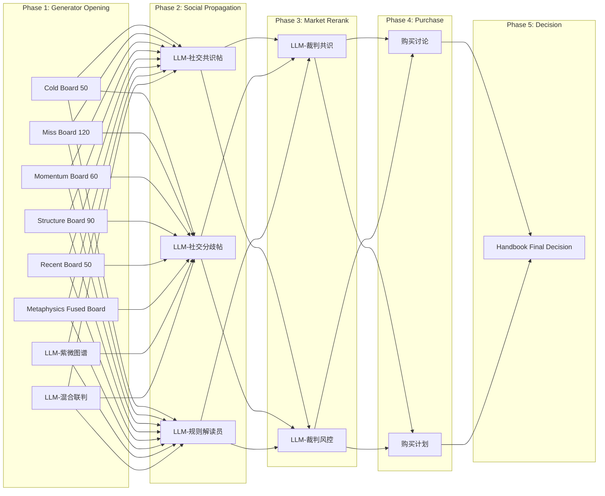

# MiroFish 选号 Agent 系统 — 架构与配置手册

> 本文档帮助你理解、配置和扩展 Agent 系统。

---

## 1. Agent 总览



### 1.1 Agent 花名册

| strategy_id | 显示名 | 组 | 类型 | 需要 LLM | 文件 |
|---|---|---|---|---|---|
| `cold_50` | Cold Board 50 | data | rule | ✗ | [data_agents.py](file:///e:/MoFish/MiroFish/backend/app/services/lottery/agents/data_agents.py) |
| `miss_120` | Miss Board 120 | data | rule | ✗ | 同上 |
| `momentum_60` | Momentum Board 60 | data | rule | ✗ | 同上 |
| `structure_90` | Structure Board 90 | data | rule | ✗ | 同上 |
| `recent_board_50` | Recent Board 50 | data | rule | ✗ | 同上 |
| `metaphysics_fused_board` | Metaphysics Fused Board | metaphysics | rule | ✗ | [metaphysics_agents.py](file:///e:/MoFish/MiroFish/backend/app/services/lottery/agents/metaphysics_agents.py) |
| `llm_ziwei_graph` | LLM-紫微图谱 | metaphysics | llm | ✓ | [llm_agents.py](file:///e:/MoFish/MiroFish/backend/app/services/lottery/agents/llm_agents.py) |
| `llm_hybrid_panel` | LLM-混合联判 | hybrid | llm | ✓ | 同上 |
| `social_consensus_feed` | LLM-社交共识帖 | social | llm | ✓ | [social_agents.py](file:///e:/MoFish/MiroFish/backend/app/services/lottery/agents/social_agents.py) |
| `social_risk_feed` | LLM-社交分歧帖 | social | llm | ✓ | 同上 |
| `rule_analyst_feed` | LLM-规则解读员 | social | llm | ✓ | [specialist_agents.py](file:///e:/MoFish/MiroFish/backend/app/services/lottery/agents/specialist_agents.py) |
| `consensus_judge` | LLM-裁判共识 | judge | llm | ✓ | [judge_agents.py](file:///e:/MoFish/MiroFish/backend/app/services/lottery/agents/judge_agents.py) |
| `risk_guard_judge` | LLM-裁判风控 | judge | llm | ✓ | 同上 |

---

## 2. 数据组 (Data Agents) 运作方式

数据组是 **纯 Python 规则 Agent**，不调用 LLM，靠计算逻辑直接输出号码。

### 2.1 每个 Agent 怎么选号

| Agent | 核心算法 | 参数 |
|---|---|---|
| **Cold Board 50** | 用 `max(出现次数) - 本号出现次数` × 8 + `连续未出现期数` × 0.8 排分 | window=50 |
| **Miss Board 120** | 纯靠 `连续未出现期数` 排分 | window=120 |
| **Momentum Board 60** | `短窗口(12期)频次 × 12 - 长窗口频次 × 2 + 遗漏 × 0.4` | window=60 |
| **Structure Board 90** | 按「区间(1-10/11-20/...)」和「尾号(0-9)」的缺失程度排分 | window=90 |
| **Recent Board 50** | `频次 × 10 + 最近一次出现的序号 × 0.2` | window=50 |

### 2.2 输入输出

- **输入**: `PredictionContext.history_draws`（历史开奖数组），`pick_size`（选几个号）
- **输出**: `StrategyPrediction`（numbers + rationale + ranked_scores）
- **无外部依赖**：不需要 LLM、Letta、Kuzu

### 2.3 如何调参

修改 [data_agents.py](file:///e:/MoFish/MiroFish/backend/app/services/lottery/agents/data_agents.py) 顶部常量：

```python
SHORT_WINDOW = 12           # MomentumShift 的短窗口
FREQUENCY_WEIGHT = 10.0     # RecentBoard 的频次权重
RECENCY_WEIGHT = 0.2        # RecentBoard 的近期权重
```

或修改 [build_data_agents()](file:///e:/MoFish/MiroFish/backend/app/services/lottery/agents/data_agents.py#154-163) 里的 `window` 参数。

---

## 3. LLM Agent 提示词结构

每个 LLM Agent 都通过 `[system_prompt, user_prompt]` 两条消息调用 LLM。

### 3.1 Prompt Pipeline（以 GraphLLMAgent 为例）

```
system_prompt:
  "你是快乐8多agent系统里的主策略LLM..."
  + (if metaphysics: "玄学结构、命盘映射...")
  + (if hybrid: "融合玄学线索与统计线索...")

user_prompt = 拼接以下 prompt_blocks:
  ┌─ target_summary()       → 目标期号/干支/能量
  ├─ optimization_goal()    → 优化目标（命中率/ROI/稳定/控热）
  ├─ expert_interview_summary() → 强信号采访纪要
  ├─ world_summary()        → 世界模拟记忆（趋势号/公开帖/采访）
  ├─ prompt_summary()       → 专用提示词文档（按agent_id筛选）
  ├─ single_ticket_rule()   → "必须选X个号码"
  ├─ history_summary()      → 近18期冷热号
  ├─ performance_summary()  → 历史命中排行榜
  ├─ report_summary()       → 外部预测/复盘报告
  ├─ graph_summary()        → 图谱摘要（Kuzu/Zep）
  ├─ knowledge snippets     → KnowledgeContextBuilder 注入的知识文档
  └─ output_schema          → JSON 格式要求
```

### 3.2 各类 Agent 的 Prompt 差异

| Agent 类型 | System Prompt 侧重 | User Prompt 额外块 |
|---|---|---|
| **GraphLLM** (generator) | 必须综合图谱+命盘+报告 | [graph_summary](file:///e:/MoFish/MiroFish/backend/app/services/lottery/agents/prompt_blocks.py#55-57), `knowledge_snippets` |
| **Social** | 像社交广场讨论员 | [social_memory_summary](file:///e:/MoFish/MiroFish/backend/app/services/lottery/agents/prompt_blocks.py#129-144), `social_feed_block` (主策略帖) |
| **Specialist** | 规则解读员立场 | [_rule_summary](file:///e:/MoFish/MiroFish/backend/app/services/lottery/agents/specialist_agents.py#235-246) (非LLM候选) |
| **Judge** | 裁判：保留共识 or 压制过热 | 读 peer 候选流 + 报告 |

### 3.3 讨论轮 (Deliberation)

当 `agentDialogueRounds > 0` 时，每个 Agent 进入多轮 deliberation：
- 额外注入 `dialogue_block()`（已有讨论记录）和 `social_feed_block()`（他人发言）
- Agent 可以修正自己的号码并留下 `comment`

### 3.4 修改提示词的方式

| 方式 | 适用场景 | 操作 |
|---|---|---|
| **编辑 system prompt** | 改 Agent 整体角色定位 | 修改对应 [_system_prompt()](file:///e:/MoFish/MiroFish/backend/app/services/lottery/agents/specialist_agents.py#212-219) 方法 |
| **编辑 prompt_blocks.py** | 改所有 Agent 共享的 prompt 块 | 修改 [prompt_blocks.py](file:///e:/MoFish/MiroFish/backend/app/services/lottery/agents/prompt_blocks.py) |
| **上传提示词文档** | 不改代码，通过文档注入 | 往 knowledge 目录放 `kind=prompt` 的文档 |
| **编辑 optimization_goal** | 改全局优化目标 | 修改 `PredictionContext.optimization_goal` |

---

## 4. 文件注入系统（Knowledge Context）

### 4.1 文件如何进入 Agent

```
knowledge 文档 → KnowledgeContextBuilder.build() → 按相关性评分排序 → 截断为 snippets → 拼入 user_prompt
```

### 4.2 关于 Letta Token 限制

- Letta 对单条消息有 token 上限
- 大文件由 `KnowledgeContextBuilder` 自动切片为 `KnowledgeSnippet`
- 每个 snippet 包含 `source`、`kind`、[score](file:///e:/MoFish/MiroFish/backend/app/services/lottery/agents/metaphysics_agents.py#105-111)、[excerpt](file:///e:/MoFish/MiroFish/backend/app/services/lottery/agents/prompt_blocks.py#238-240)
- 只有 top-N 个 snippet 被注入（对话轮限制为 `DIALOGUE_SNIPPET_LIMIT = 4`）

### 4.3 提示词文档路由

[prompt_summary()](file:///e:/MoFish/MiroFish/backend/app/services/lottery/agents/prompt_blocks.py#70-89) 会根据 `agent_id` 关键词自动匹配最相关的提示词文档：

| Agent 含关键词 | 优先匹配文档名包含 |
|---|---|
| [social](file:///e:/MoFish/MiroFish/backend/app/services/lottery/agents/prompt_blocks.py#125-127) | `narrator`, [social](file:///e:/MoFish/MiroFish/backend/app/services/lottery/agents/prompt_blocks.py#125-127) |
| [judge](file:///e:/MoFish/MiroFish/backend/app/services/lottery/agents/judge_agents.py#244-266), `purchase` | `advisor`, `betting` |
| `ziwei`, `hybrid` | `extractor`, `classifier` |

---

## 5. Execution Config（模型绑定配置）

配置文件：[execution_config.yaml](file:///e:/MoFish/MiroFish/backend/app/services/lottery/execution_config.yaml)

### 5.1 三级 Override 体系

```
role_defaults → group_overrides → agent_overrides
（越后面优先级越高）
```

### 5.2 当前 Profile 定义

| profile_id | temperature | max_tokens | json_mode | 适用于 |
|---|---|---|---|---|
| [default](file:///e:/MoFish/MiroFish/frontend/src/components/LotteryWorldControlPanel.vue#230-231) | 0.7 | 2000 | false | 兜底 |
| `generator_default` | 0.3 | 1600 | true | data/metaphysics 组 |
| `social_default` | 0.5 | 1200 | true | social 组 |
| `judge_default` | 0.2 | 2000 | true | judge 组 |
| `purchase_default` | 0.1 | 2000 | true | 购买 |
| `decision_default` | 0.2 | 4000 | true | 终判 |

### 5.3 如何为某个 Agent 指定不同模型

```yaml
# 方法1: 在 execution_config.yaml 里加 agent_overrides
agent_overrides:
  llm_ziwei_graph: my_custom_profile

# 方法2: 前端 UI 的 "Execution Bindings" 面板（运行时覆盖）
```

---

## 6. Agent 间关系和交流

### 6.1 执行阶段（Phase）

| 阶段 | 参与 Agent | 读取什么 | 输出什么 |
|---|---|---|---|
| **generator_opening** | data(5) + metaphysics(1) + LLM(2) | 历史数据, 图谱, 命盘, 知识 | `StrategyPrediction` |
| **social_propagation** | social(2) + specialist(1) | 上面所有预测 + 排行榜 | 社交帖 + 修正号码 |
| **market_rerank** | judge(2) | 所有候选 + 讨论帖 | 裁判意见 + 最终号码 |
| **plan_synthesis** | 购买讨论/计划 | 所有号码 + 反拥挤分析 | 购买方案（金额/注数） |
| **handbook_final_decision** | 终判 Agent | 所有上述 + 反拥挤信号 | 单注最终号码 |

### 6.2 交流限制

- **数据组 → 不读其他 Agent**，只用历史开奖
- **LLM 组 → 不读社交/裁判**，只用原始数据+图谱+知识
- **社交组 → 读所有主策略候选** (`context.peer_predictions`)
- **裁判组 → 读所有候选+社交帖** (`context.peer_predictions`)
- **购买 → 读所有号码+反拥挤分析**
- **终判 → 读所有+购买方案**

### 6.3 信任网络

社交 Agent 维持 `trust_network`（信任排行），每轮可在输出中指定 `trusted_strategy_ids`，影响权重分配。

---

## 7. 如何新增 Agent

### 7.1 新增一个数据组 Agent（不用 LLM）

1. 在 [data_agents.py](file:///e:/MoFish/MiroFish/backend/app/services/lottery/agents/data_agents.py) 新增 `@dataclass(frozen=True)` 类，继承 `StrategyAgent`
2. 实现 [predict(context, pick_size) → StrategyPrediction](file:///e:/MoFish/MiroFish/backend/app/services/lottery/agents/judge_agents.py#48-55)
3. 在 [build_data_agents()](file:///e:/MoFish/MiroFish/backend/app/services/lottery/agents/data_agents.py#154-163) 中注册

```python
# data_agents.py — 示例

@dataclass(frozen=True)
class MyCustomAgent(StrategyAgent):
    window: int

    def predict(self, context, pick_size):
        self.ensure_history(context)
        # ... 你的选号逻辑
        return StrategyPrediction(
            strategy_id=self.strategy_id,
            display_name=self.display_name,
            group=self.group,
            numbers=select_numbers(scores, pick_size),
            rationale="...",
            ranked_scores=rank_scores(scores, pick_size),
        )

def build_data_agents():
    agents = [
        # ... existing agents ...
        MyCustomAgent("my_custom", "My Custom Agent", "...", 60, GROUP, window=60),
    ]
    return {a.strategy_id: a for a in agents}
```

### 7.2 新增一个 LLM Agent

1. 在合适的文件（如 [social_agents.py](file:///e:/MoFish/MiroFish/backend/app/services/lottery/agents/social_agents.py)）中新增 `@dataclass(frozen=True)` 类
2. 继承现有 Agent 基类（如 [SocialDiscussionAgent](file:///e:/MoFish/MiroFish/backend/app/services/lottery/agents/social_agents.py#41-265)、[LLMJudgeAgent](file:///e:/MoFish/MiroFish/backend/app/services/lottery/agents/judge_agents.py#37-242)）
3. 在对应的 `build_xxx_agents()` 中注册
4. 如需独立模型，在 [execution_config.yaml](file:///e:/MoFish/MiroFish/backend/app/services/lottery/execution_config.yaml) 中加 `agent_overrides`

### 7.3 修改 Agent 接收的内容

每个 LLM Agent 的 [_build_messages()](file:///e:/MoFish/MiroFish/backend/app/services/lottery/agents/llm_agents.py#91-117) 控制了它能看到什么。要增减信息源：
- 在 [prompt_blocks.py](file:///e:/MoFish/MiroFish/backend/app/services/lottery/agents/prompt_blocks.py) 中新增 block 函数
- 在目标 Agent 的 [_build_messages()](file:///e:/MoFish/MiroFish/backend/app/services/lottery/agents/llm_agents.py#91-117) 中引用

---

## 8. 关键文件索引

| 文件 | 功能 |
|---|---|
| [agents/base.py](file:///e:/MoFish/MiroFish/backend/app/services/lottery/agents/base.py) | `StrategyAgent` 基类 |
| [agents/prompt_blocks.py](file:///e:/MoFish/MiroFish/backend/app/services/lottery/agents/prompt_blocks.py) | 14 个可复用 prompt 块函数 |
| [agents/llm_support.py](file:///e:/MoFish/MiroFish/backend/app/services/lottery/agents/llm_support.py) | LLM 调用、号码验证、社交 feed 格式化 |
| [agents/helpers.py](file:///e:/MoFish/MiroFish/backend/app/services/lottery/agents/helpers.py) | 选号工具函数（hot_counts, miss_streaks 等） |
| [execution_config.yaml](file:///e:/MoFish/MiroFish/backend/app/services/lottery/execution_config.yaml) | 模型 profile 定义 + 3 级绑定 |
| [execution_registry.py](file:///e:/MoFish/MiroFish/backend/app/services/lottery/execution_registry.py) | YAML 配置的运行时加载器 |
| [knowledge_context.py](file:///e:/MoFish/MiroFish/backend/app/services/lottery/knowledge_context.py) | 知识文档 → snippet 切片注入 |
| [world_v2_runtime.py](file:///e:/MoFish/MiroFish/backend/app/services/lottery/world_v2_runtime.py) | 执行引擎主循环（含购买+终判） |
